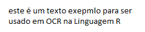
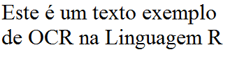
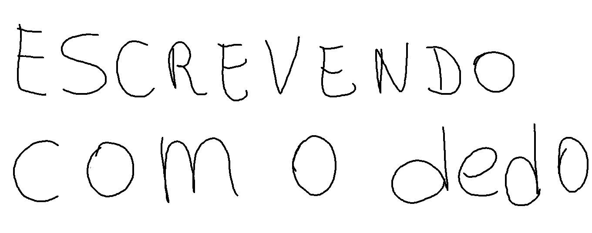

```{r setup, include=FALSE}
knitr::opts_chunk$set(echo = TRUE)
```

We'll using Optical character recognition (OCR). This process of extracting written text from images into machine-encoded text. The package Tesseract brings one of the best open-source OCR engines to R. 


### 1-Defining a function to check if package are installed

```{r, message=F, warning=F}
is.installed <- function(mypkg) is.element(mypkg, installed.packages()[,1]) 

if(!is.installed("tesseract"))
   install.packages("tesseract")
```

<BR>
**Load library**
```{r, message=F, warning=F}
library("tesseract")
```
<BR>

### 2-Loading Images and processing OCR

**The First Image**


<BR><BR>
***Load imagem one and extract characters by OCR with low quality of image***

```{r, message=F, warning=F}
text <- ocr("data/imagemExemplo.png")
cat(text)
```
<BR>
Take a look at the results. Some words are wrong because the resulution is low.
<BR>
<BR>
**The Second Image**


<BR><BR>
***Load imagem one and extract characters by OCR with low quality of image***

```{r, message=F, warning=F}
text <- ocr("data/imagemExemplo2.png")
cat(text)
```

<br>
Now, you can load a hand write image. I draw this on Paitbrush with my finger over a touch screen.

***Load hand write image***



```{r, message=F, warning=F}
text <- ocr("data/imagemExemplo3.png")
cat(text)
```


<BR>
[The Scientist](http://www.thescientist.com.br)
<BR><BR>
